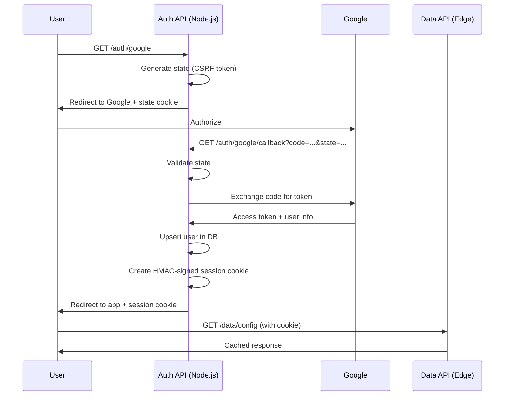

# Edge-Minimal Backend Stack

A **production-ready**, minimal backend boilerplate optimized for ultra-low latency on Vercel's edge network.

## Features

- **Dual Runtime Support**: Node.js for auth, Edge for data
- **Clean Architecture**: Layered, maintainable, no enterprise bloat
- **Google OAuth 2.0**: Stateless session cookies with HMAC signing
- **Edge Caching**: CDN-optimized data endpoints
- **Rate Limiting**: Best-effort protection against abuse
- **TypeScript**: Full type safety
- **Turso SQLite**: Minimal database for config & metadata
- **Free-tier Friendly**: Optimized for cost efficiency

## 📁 Project Structure

```
edge-minimal-stack/
├── api/                    # Vercel entry points
│   ├── auth/              # Node.js runtime (OAuth, sessions)
│   │   ├── _runtime.ts
│   │   ├── login.ts
│   │   ├── logout.ts
│   │   ├── google.ts
│   │   └── google/
│   │       └── callback.ts
│   └── data/              # Edge runtime (cached data)
│       ├── _runtime.ts
│       ├── app.ts
│       ├── config.ts
│       └── flags.ts
├── src/
│   ├── domain/            # Types & entities
│   ├── services/          # Business logic
│   ├── infra/            # Infrastructure
│   │   ├── db/           # Database client
│   │   ├── crypto/       # HMAC signing
│   │   ├── oauth/        # Google OAuth
│   │   └── rate-limit/   # In-memory limiter
│   └── shared/           # Utilities & constants
├── package.json
├── tsconfig.json
├── vercel.json
└── .env.example
```

## Quick Start

### 1. Install Dependencies

```bash
npm install
```

### 2. Set Up Environment

Copy `.env.example` to `.env` and fill in your values:

```bash
cp .env.example .env
```

**Required variables**:
- `DATABASE_URL`: Your Turso database URL
- `DATABASE_AUTH_TOKEN`: Turso auth token
- `GOOGLE_CLIENT_ID`: Google OAuth client ID
- `GOOGLE_CLIENT_SECRET`: Google OAuth client secret
- `GOOGLE_REDIRECT_URI`: OAuth callback URL
- `SESSION_SECRET`: Random 32+ character string

### 3. Initialize Database

Run the schema against your Turso database:

```bash
# Using Turso CLI
turso db shell your-database < src/infra/db/schema.sql

# Or using libsql client
npx @libsql/client --url $DATABASE_URL --auth-token $DATABASE_AUTH_TOKEN < src/infra/db/schema.sql
```

### 4. Run Locally

```bash
npm run dev
```

Visit `http://localhost:3000/api/auth/google` to test OAuth flow.

### 5. Deploy to Vercel

```bash
npm run deploy
```

## Authentication Flow



**Key Security Features**:
- `state` parameter for CSRF protection
- HMAC-signed cookies (no tampering)
- HttpOnly, Secure, SameSite cookies
- No session database (stateless)
- 7-day expiration

## API Endpoints

### Auth API (Node.js Runtime)

| Method | Path | Description |
|--------|------|-------------|
| `POST` | `/auth/login` | Email/password login (placeholder) |
| `POST` | `/auth/logout` | Destroy session |
| `GET` | `/auth/google` | Initiate Google OAuth |
| `GET` | `/auth/google/callback` | Handle OAuth callback |
| `GET` | `/auth/session` | Validate current session |

### Data API (Edge Runtime)

| Method | Path | Description | Cache |
|--------|------|-------------|-------|
| `GET` | `/data/app` | App metadata | 10 min |
| `GET` | `/data/config` | App configuration | 5 min |
| `GET` | `/data/flags` | Feature flags | 1 min |

## Edge Caching Strategy

All data endpoints return CDN cache headers:

```http
Cache-Control: public, s-maxage=300, stale-while-revalidate=600
```

- **`s-maxage`**: CDN cache duration (varies by endpoint)
- **`stale-while-revalidate`**: Serve stale while fetching fresh

## Rate Limiting

**Important**: Rate limiting is **best-effort only**, not globally consistent.

- **Auth endpoints**: 10 requests / 15 minutes
- **Data endpoints**: 100 requests / 1 minute

**Limitations**:
- Edge: Per-isolate, per-region
- Node.js: Per-instance, resets on cold start
- Purpose: Cost protection & basic abuse prevention

## Architecture Principles

### Clean Architecture (Minimal)

- **Services are plain functions** (no classes, no DI framework)  
- **Direct database calls** (no repository layer)  
- **No over-abstraction** (KISS principle)  
- **Layered structure** (routes → services → infra)

### Runtime Separation

**CRITICAL**: Runtime is set **per-file**, not in `vercel.json`.

```typescript
// api/auth/_runtime.ts
export const runtime = 'nodejs';

// api/auth/google.ts
export { runtime } from './_runtime'; // Re-export
```

### Session Management

- **Stateless**: HMAC-signed cookies
- **No database writes** on every request
- **No refresh tokens** (simple 7-day session)
- **Revocation**: Cookie expiry only

## Database Schema

**Tables**:
- `users`: OAuth user profiles
- `app_config`: Key-value configuration
- `feature_flags`: Feature toggles

**No `sessions` table** - we use stateless cookies.

## Development

### Type Check

```bash
npm run build
```

### Environment Variables

See [.env.example](.env.example) for all required variables.

### Google OAuth Setup

1. Go to [Google Cloud Console](https://console.cloud.google.com/)
2. Create a new project
3. Enable "Google+ API"
4. Create OAuth 2.0 credentials
5. Set authorized redirect URI: `https://api.yourdomain.com/auth/google/callback`
6. Copy client ID and secret to `.env`

## Deployment Checklist

- [ ] Set environment variables in Vercel dashboard
- [ ] Initialize Turso database with schema
- [ ] Configure Google OAuth redirect URI
- [ ] Generate secure `SESSION_SECRET` (32+ chars)
- [ ] Set `ALLOWED_ORIGIN` to your frontend domain
- [ ] Test OAuth flow locally with `vercel dev`
- [ ] Deploy with `vercel --prod`

## Use Cases

This boilerplate is ideal for:

- SaaS backends with OAuth
- Read-heavy APIs (edge-optimized)
- Minimal config/metadata storage
- Free-tier deployments
- Low-latency requirements

**Not suitable for**:
- Write-heavy workloads
- Complex relational queries
- Real-time features (use WebSockets)
- Large file uploads

## Learn More

- [ARCHITECTURE.md](./ARCHITECTURE.md) - Detailed architecture documentation
- [Vercel Edge Runtime](https://vercel.com/docs/functions/edge-functions)
- [Turso SQLite](https://turso.tech/docs)
- [Google OAuth 2.0](https://developers.google.com/identity/protocols/oauth2)

## License

MIT - Use freely for any project.

---

**Built with minimal, edge-first architectures in mind**
