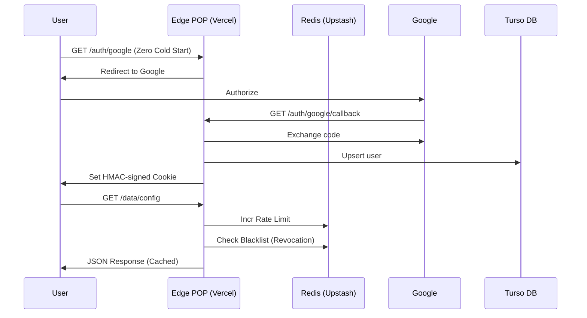

# Edge-Minimal Backend Stack

[](./LICENSE)

A **production-ready**, minimal backend boilerplate optimized for ultra-low latency on Vercel's edge network.

## Features

- **100% Edge Runtime**: Auth, Data, and Media APIs all run on the Edge POPs for **Zero Cold Starts**.
- **Distributed Safety**: Rate limiting & Session Revocation via **Upstash Redis** (Global consistency).
- **Ultra-fast Config**: Sub-ms reads for flags and maintenance mode via **Vercel Edge Config**.
- **Clean Architecture**: Modular folder structure (`core`, `modules`, `infra`) with a **Unified Handler**.
- **Secure Sessions**: HMAC-signed cookies (Web Crypto API) with global session revocation.
- **Type-safe Validation**: Automatic request validation using **Zod** in every rute.
- **Minimal Latency**: Turso SQLite + Upstash Redis both optimized for Edge environments.

## Documentation

- [Architecture Reference](./ARCHITECTURE.md) - Deep dive into the core principles.
- [Development Guide](./DEV_GUIDE.md) - Commands, troubleshooting, and local setup.

##  Project Structure

```
edge-minimal-stack/
├── api/                    # Vercel entry points (Flat & Clean)
│   ├── auth/              # Edge Runtime (OAuth, sessions)
│   ├── data/              # Edge Runtime (cached data)
│   └── media/             # Edge Runtime (media metadata)
├── src/
│   ├── core/              # Universal logic (Handler, Validation)
│   ├── modules/           # Domain logic (formerly services)
│   ├── infra/             # Driver Adapters
│   │   ├── db/            # Turso SQLite client
│   │   ├── redis/         # Upstash Redis client
│   │   ├── crypto/        # Web Crypto HMAC signing
│   │   ├── config/        # Vercel Edge Config
│   │   └── oauth/         # Google OAuth provider
│   └── shared/            # Utilities, schemas, & constants
├── public/                 # Static assets (Docs, Landing)
├── vercel.json             # Deployment & Rewrites config
└── .env.example
├── package.json
├── tsconfig.json
├── vercel.json
└── .env.example
```

## Quick Start

### 1. Install Dependencies

```bash
npm install
```

### 2. Set Up Environment

Copy `.env.example` to `.env` and fill in your values:

```bash
cp .env.example .env
```

**Required variables**:
- `DATABASE_URL`: Your Turso database URL
- `DATABASE_AUTH_TOKEN`: Turso auth token
- `UPSTASH_REDIS_REST_URL`: Upstash REST URL
- `UPSTASH_REDIS_REST_TOKEN`: Upstash REST token
- `EDGE_CONFIG`: Vercel Edge Config connection string
- `GOOGLE_CLIENT_ID`: Google OAuth client ID
- `GOOGLE_CLIENT_SECRET`: Google OAuth client secret
- `GOOGLE_REDIRECT_URI`: OAuth callback URL
- `SESSION_SECRET`: Random 32+ character string
- `ALLOWED_ORIGIN`: Your frontend domain

### 3. Initialize Database

Run the schema against your Turso database:

```bash
# Using Turso CLI
turso db shell your-database < src/infra/db/schema.sql

# Or using libsql client
npx @libsql/client --url $DATABASE_URL --auth-token $DATABASE_AUTH_TOKEN < src/infra/db/schema.sql
```

### 4. Run Locally

```bash
npm run dev
```

Visit `http://localhost:3000/api/auth/google` to test OAuth flow.

### 5. Deploy to Vercel

```bash
npm run deploy
```

## Authentication Flow



**Key Security Features**:
- `state` parameter for CSRF protection
- HMAC-signed cookies (no tampering)

## API Endpoints

### Auth API (Edge Runtime)

| Method | Path | Description | Rate Limit |
|--------|------|-------------|------------|
| `POST` | `/auth/login` | Email/password login | 10 req / 15m |
| `POST` | `/auth/logout` | Destroy session | - |
| `GET` | `/auth/google` | Initiate Google OAuth | - |
| `GET` | `/auth/google/callback` | Handle OAuth callback | - |
| `GET` | `/auth/session` | Validate current session | 100 req / 1m |

### Data & Media API (Edge Runtime)

| Method | Path | Description | Cache |
|--------|------|-------------|-------|
| `GET` | `/data/config` | App configuration | 5 min |
| `GET` | `/data/flags` | Feature flags | 1 min |
| `GET` | `/media/:id` | Media metadata | 10 min |

## Edge Caching Strategy

All data endpoints return CDN cache headers:

```http
Cache-Control: public, s-maxage=300, stale-while-revalidate=600
```

- **`s-maxage`**: CDN cache duration (varies by endpoint)
- **`stale-while-revalidate`**: Serve stale while fetching fresh

**Distributed Logic**: Powered by **Upstash Redis**, ensuring consistent limits across all global POPs.

- **Storage**: < 1ms read/write from Edge logic.
- **Fail-safe**: Logic falls open (success) if Redis is unreachable to avoid blocking users.
- **Consistency**: Prevents brute-force even when Vercel scales horizontally.

## Architecture Principles

### Clean Architecture (Minimal)

- **Services are plain functions** (no classes, no DI framework)  
- **Direct database calls** (no repository layer)  
- **No over-abstraction** (KISS principle)  
- **Layered structure** (routes → services → infra)

### Runtime Separation

**CRITICAL**: Runtime is set **per-file**, not in `vercel.json`.

```typescript
// api/auth/_runtime.ts
export const runtime = 'nodejs';

// api/auth/google.ts
export { runtime } from './_runtime'; // Re-export
```

#- **Stateless**: HMAC-signed cookies (Web Crypto API).
- **Global Revocation**: Integrated with Redis for force-logout capability.
- **Security Check**: Each request validates against a "revoked" list in Redis.

## Database Schema

**Tables**:
- `users`: OAuth user profiles
- `app_config`: Key-value configuration
- `feature_flags`: Feature toggles

**No `sessions` table** - we use stateless cookies.

## Development

### Type Check

```bash
npm run build
```

### Environment Variables

See [.env.example](.env.example) for all required variables.

### Google OAuth Setup

1. Go to [Google Cloud Console](https://console.cloud.google.com/)
2. Create a new project
3. Enable "Google+ API"
4. Create OAuth 2.0 credentials
5. Set authorized redirect URI: `https://api.yourdomain.com/auth/google/callback`
6. Copy client ID and secret to `.env`

## Deployment Checklist

- [ ] Set environment variables in Vercel dashboard
- [ ] Initialize Turso database with schema
- [ ] Configure Google OAuth redirect URI
- [ ] Generate secure `SESSION_SECRET` (32+ chars)
- [ ] Set `ALLOWED_ORIGIN` to your frontend domain
- [ ] Test OAuth flow locally with `vercel dev`
- [ ] Deploy with `vercel --prod`

## Use Cases

This boilerplate is ideal for:

- SaaS backends with OAuth
- Read-heavy APIs (edge-optimized)
- Minimal config/metadata storage
- Free-tier deployments
- Low-latency requirements

**Not suitable for**:
- Write-heavy workloads
- Complex relational queries
- Real-time features (use WebSockets)
- Large file uploads

## Learn More

- [ARCHITECTURE.md](./ARCHITECTURE.md) - Detailed architecture documentation
- [Vercel Edge Runtime](https://vercel.com/docs/functions/edge-functions)
- [Turso SQLite](https://turso.tech/docs)
- [Google OAuth 2.0](https://developers.google.com/identity/protocols/oauth2)

## License

This project is licensed under the [MIT License](./LICENSE). Use freely for any project.

---

**Built with minimal, edge-first architectures in mind**
